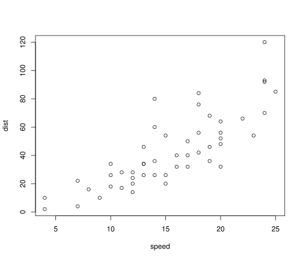

Practical Machine Learning - Prediction Assignment Writeup
========================================================

## Cleaning up the Data
Let's read the data and get some idea about its size.

```r
testData <- read.csv("../data//pml-testing.csv", stringsAsFactors=TRUE)
trainingData <- read.csv("../data//pml-training.csv", stringsAsFactors=TRUE)

dim(testData)
```

```
## [1]  20 160
```

```r
dim(trainingData)
```

```
## [1] 19622   160
```
Some of the columns are all NAs, because those might become a problem in the downstream analysis, they should be removed.

```r
removeNACols <- function(df) {
  return(df[, colSums(is.na(df)) != nrow(df)])
}

testData <- removeNACols(testData)
trainingData <- removeNACols(trainingData)

dim(testData)
```

```
## [1] 20 60
```

```r
dim(trainingData)
```

```
## [1] 19622   160
```

## Feature Selection
Instead of using the correlation based feature selection algorithm by Mark Hall, proposed by the authors, I used elastic net to choose the most important features. (TODO: Give a proper reason here)

## Preprocessing and Cross Validation

## Training the Classifier

## Prediction on the Testset


```r
summary(cars)
```

```
##      speed           dist    
##  Min.   : 4.0   Min.   :  2  
##  1st Qu.:12.0   1st Qu.: 26  
##  Median :15.0   Median : 36  
##  Mean   :15.4   Mean   : 43  
##  3rd Qu.:19.0   3rd Qu.: 56  
##  Max.   :25.0   Max.   :120
```

You can also embed plots, for example:


```r
plot(cars)
```

 

