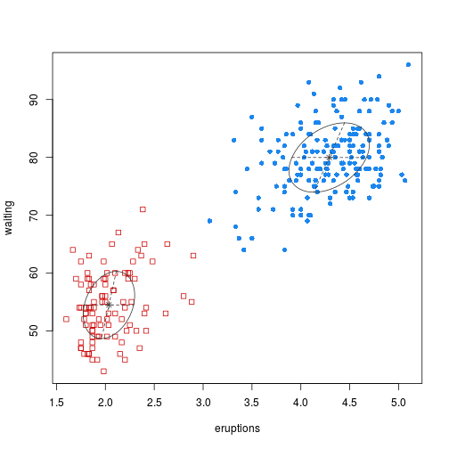
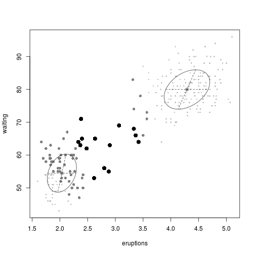

Mixture Modeling for Model-Based Clustering
======================================
author: Jens Hooge
date: 24.08.2014
transition: rotate

## A shiny app for Coursera's "Developing Data Products" course

What is Model-Based Clustering?
===

The model-based clustering approach consists in using certain models for clusters 
and attempting to optimize the fit between the data and the model.

In practice, each cluster can be mathematically represented by a parametric distribution, like a Gaussian (continuous) or a Poisson (discrete). The entire data set is therefore modelled by a mixture of these distributions. An individual distribution used to model a specific cluster is often referred to as a component distribution.

Features
===

 
***
A mixture model with high likelihood tends to have the following traits:

- Component distributions have high “peaks” (data in one cluster are tight);
- The mixture model “covers” the data well (dominant patterns in the data are captured by component distributions).

Classification in Action
===

 
***
 

Where do I get it?
===
Try it on [shinyapps.io](http://jhooge.shinyapps.io/MixtureModeling/)  or 
<a href="https://github.com/jhooge/CourseraCourses/tree/master/DataScience/9_DevelopingDataProducts" target="_blank"/>Github</a>!

- It uses Mixtures of Gaussians for a Model Based Cluster analysis of the Pima Indian Diabetes Database.
- Up to nine components can be chosen for the mixtures. 
- The supervised classification result, together with classification uncertainty and errors can be observed in 2D projections of the feature space.
